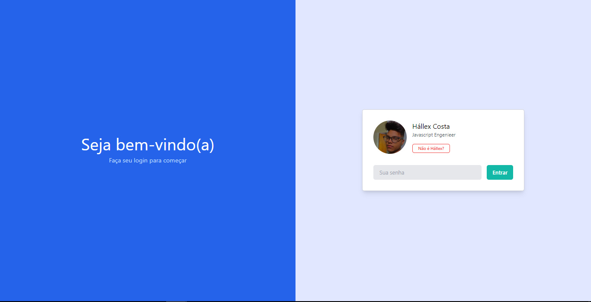

# My first website TailwindCSS

You can access website click <a href="https://google.coma/" target="_blank">here</a>



### How to run project?

```sh
# Install dependencies
$ yarn # or npm -i

# Process tailwindcss (use this only if you edit css from page)
$ tailwindcss -i ./src/main.css -o ./public/style.css

# Run http-server
$ yarn start

# Acccess page: http://localhost:8080
```

Developed by [Hállex](https://github.com/hallexcosta)
